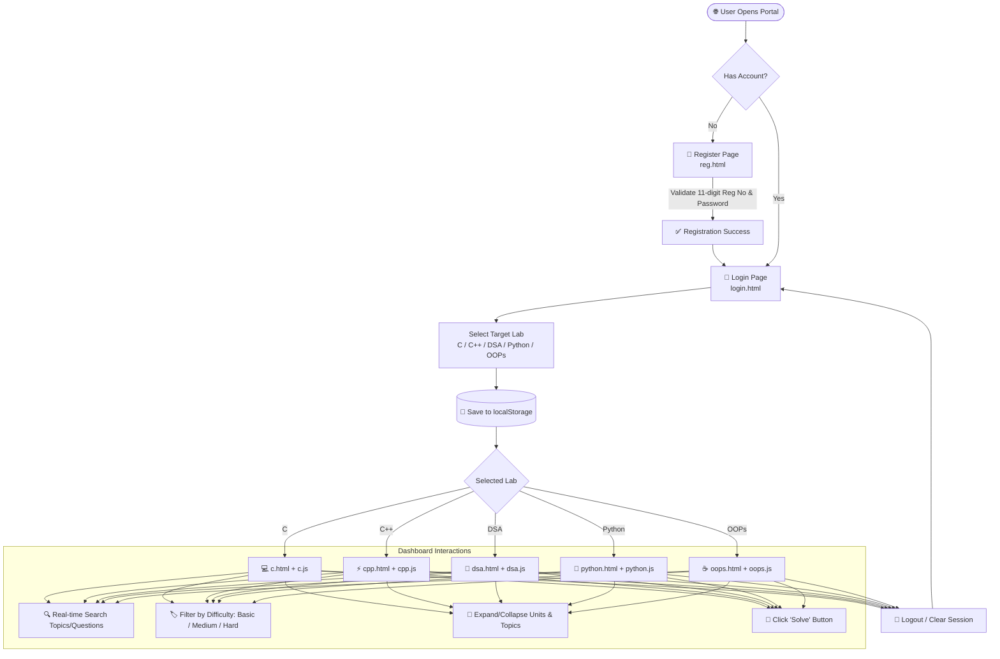

<div align="center">

# ⚡ Lab-Mentor (SkillGate)
### *Next-Generation Interactive Laboratory Tracking & Coding Practice Platform*

[](https://developer.mozilla.org/en-US/docs/Web/HTML)
[](https://developer.mozilla.org/en-US/docs/Web/CSS)
[](https://developer.mozilla.org/en-US/docs/Web/JavaScript)
[](LICENSE)
[](https://github.com/Kundan-44/Lab-Mentor/pulls)
[](https://github.com/Kundan-44/Lab-Mentor)

<p align="center">
  <b>A comprehensive, modular, and curriculum-aligned lab tracking portal designed for engineering students to master programming languages and Data Structures through structured problem sets.</b>
</p>

<p align="center">
  <a href="#-overview">Overview</a> •
  <a href="#-key-features">Key Features</a> •
  <a href="#-curriculum--lab-modules">Lab Modules</a> •
  <a href="#-architecture--workflow">Architecture</a> •
  <a href="#-tech-stack">Tech Stack</a> •
  <a href="#-project-structure">Project Structure</a> •
  <a href="#-getting-started">Getting Started</a> •
  <a href="#-roadmap">Roadmap</a> •
  <a href="#-contributing">Contributing</a>
</p>

---

</div>

## 📌 Overview

**Lab-Mentor** (also branded as **SkillGate**) is a responsive, client-side web application built to streamline the academic programming lab experience. It solves the fragmentation in computer science coursework by providing a unified, unit-by-unit tracking dashboard across major programming domains: **C**, **C++**, **Data Structures & Algorithms (DSA)**, **Python**, and **Object-Oriented Programming (Java)**.

Students can authenticate, choose their enrolled lab track, explore structured units and topics, filter challenges by difficulty (Basic, Medium, Hard), search questions in real-time, and track their syllabus progress interactively.

---

## ✨ Key Features

<table>
  <tr>
    <td width="50%">
      <h3>🎯 Multi-Subject Lab Hub</h3>
      <p>Single platform catering to <b>5 complete academic labs</b>: C Programming, C++, DSA, Python, and Object-Oriented Programming in Java.</p>
    </td>
    <td width="50%">
      <h3>📚 Unit & Topic Hierarchy</h3>
      <p>Hierarchical curriculum organization from <b>Unit ➔ Topic ➔ Curated Coding Questions</b> with collapsible accordion navigation.</p>
    </td>
  </tr>
  <tr>
    <td width="50%">
      <h3>⚡ Instant Filtering & Search</h3>
      <p>Real-time fuzzy search bar and one-click difficulty badges (<code>All</code>, <code>Basic</code>, <code>Medium</code>, <code>Hard</code>) for quick problem discovery.</p>
    </td>
    <td width="50%">
      <h3>📊 Visual Progress Tracking</h3>
      <p>Dynamic progress bars per unit that visually indicate completion status and learning momentum.</p>
    </td>
  </tr>
  <tr>
    <td width="50%">
      <h3>🔐 Smart Form Validation & Auth</h3>
      <p>Registration and login flows with regex pattern validation for 11-digit university registration numbers and strong password policies.</p>
    </td>
    <td width="50%">
      <h3>💾 Client-Side Session Persistence</h3>
      <p>Utilizes <code>localStorage</code> to store selected lab preferences, user state, and active sessions seamlessly without complex server setup.</p>
    </td>
  </tr>
</table>

---

## 🔬 Curriculum & Lab Modules

Lab-Mentor covers over **150+ curated lab problems** systematically mapped across 5 programming domains:

<details>
<summary><b>1. 💻 C Programming Lab (6 Units)</b></summary>
<br>

| Unit | Title | Key Topics Covered |
| :--- | :--- | :--- |
| **Unit 1** | C Programming Basics | Input/Output, Arithmetic Operations, Conditional Statements (`if-else`, `switch`) |
| **Unit 2** | Loops & Functions | `for`, `while`, `do-while` loops, Factorials, Prime Checks, Modular Functions, GCD |
| **Unit 3** | Arrays & Strings | 1D/2D Arrays, Element Search, String Traversals, Palindromes, Anagrams |
| **Unit 4** | Pointers & Structures | Pointer Arithmetic, Swapping, Student Record Management Structures |
| **Unit 5** | Searching & Sorting | Linear Search, Binary Search, Bubble Sort, Selection Sort, Insertion Sort |
| **Unit 6** | Advanced C Programming | Dynamic Memory (`malloc`, `calloc`, `realloc`), File I/O Operations, Recursion, Tower of Hanoi |

</details>

<details>
<summary><b>2. ⚡ C++ Programming Lab (3 In-Depth Units)</b></summary>
<br>

| Unit | Title | Key Topics Covered |
| :--- | :--- | :--- |
| **Unit 1** | C++ Fundamentals | Syntax, Data Types, Control Flow, Break/Continue, Nested Loops, Function Overloading |
| **Unit 2** | Object-Oriented Paradigms | Classes & Objects, Constructors/Destructors, Encapsulation, Inheritance, Polymorphism, Abstract Classes, Friend Functions, Operator Overloading, Exception Handling |
| **Unit 3** | Advanced C++ & STL | Pointers, Dynamic Memory, Function/Class Templates, Standard Template Library (STL), File Streams, Lambdas, Smart Pointers, Multithreading |

</details>

<details>
<summary><b>3. 🌲 Data Structures & Algorithms Lab (12 Units)</b></summary>
<br>

| Unit | Title | Key Topics Covered |
| :--- | :--- | :--- |
| **Unit 1 & 2** | Arrays & Strings | Frequency Count, Non-repeating Characters, Array Reversal, Substring Search |
| **Unit 3** | Linked Lists | Singly Linked List, Doubly Linked List, Insertion, Deletion, Reversal |
| **Unit 4 & 5** | Stacks & Queues | Array-based Stacks, Infix to Postfix, Circular Queues, Deque |
| **Unit 6** | Recursion & Backtracking | Classic Recursion, N-Queens, Maze Solvers, Subsets |
| **Unit 7 & 8** | Searching & Sorting | Linear/Binary Search, Merge Sort, Quick Sort, Heap Sort |
| **Unit 9 & 10** | Trees & Graphs | Binary Trees, BST Operations, Traversals (BFS/DFS), Shortest Path |
| **Unit 11 & 12**| Dynamic Programming & Greedy | 0/1 Knapsack, Longest Common Subsequence, Activity Selection, Fractional Knapsack |

</details>

<details>
<summary><b>4. 🐍 Python Programming Lab (6 Units)</b></summary>
<br>

| Unit | Title | Key Topics Covered |
| :--- | :--- | :--- |
| **Unit 1** | Python Basics | Dynamic Typing, I/O, Arithmetic & Logical Operators, Conditionals |
| **Unit 2** | Loops & Functions | Iterators, Nested Loops, Lambda Functions, Recursion, Scope |
| **Unit 3** | Lists, Tuples & Dictionaries | List Comprehensions, Tuples, Key-Value Maps, Set Operations |
| **Unit 4** | Strings & Advanced Recursion | String Slicing, Palindrome Validation, Anagrams, Fibonacci Generators |
| **Unit 5** | OOP in Python | Classes, `__init__` Constructors, Methods, Inheritance, Polymorphism |
| **Unit 6** | File & Exception Handling | `try-except-finally`, Custom Exceptions, File Reading/Writing/Appending |

</details>

<details>
<summary><b>5. ☕ Object-Oriented Programming (Java) Lab (6 Units)</b></summary>
<br>

| Unit | Title | Key Topics Covered |
| :--- | :--- | :--- |
| **Unit 1** | Java Fundamentals | JDK Architecture, JVM, Scanner I/O, Methods, Class Declarations |
| **Unit 2** | Core OOP Principles | Default & Parameterized Constructors, Getters/Setters, Method Overriding |
| **Unit 3** | Abstraction & Interfaces | Abstract Base Classes, Interface Implementation, Multiple Inheritance Simulation |
| **Unit 4** | Collections Framework | `ArrayList`, `HashSet`, `HashMap`, Iterator Patterns, Array Utilities |
| **Unit 5** | Exception & File Handling | Checked/Unchecked Exceptions, Custom Exceptions, File Streams & Buffers |
| **Unit 6** | Advanced Java | Thread Lifecycle, `Runnable` Interface, Thread Synchronization |

</details>

---

## 🏗️ Architecture & Workflow



---

## 🛠️ Tech Stack

<div align="center">

| Area | Technology | Description |
| :--- | :--- | :--- |
| **Frontend Core** | `HTML5` | Semantic structure, accessible forms, meta viewport support |
| **Styling & Layout** | `CSS3` | Flexbox, CSS Grid, Glassmorphic effects, linear gradients, keyframe animations |
| **Client Scripting** | `JavaScript (ES6+)` | DOM rendering, dynamic data-driven templates, event listeners |
| **Storage & State** | `Web Storage API` | `localStorage` for session retention and lab selection |
| **Design System** | `Custom Vanilla CSS` | Modular styling (`common.css`, `login.css`, `register.css`) |

</div>

---

## 📁 Project Structure

```bash
Lab-Tracker/
│
├── README.md                     # 📖 Project documentation & guide
│
└── frontend/                     # 🎨 Frontend application root
    ├── assets/                   # 🖼️ Static media and assets
    │   ├── icons/                # SVG / PNG lab and topic icons
    │   ├── images/               # UI graphics & mockups
    │   ├── profile_icon.webp     # Student avatar asset
    │   └── user.png              # User profile graphic
    │
    ├── css/                      # 🎨 Stylesheet definitions
    │   ├── common.css            # Global theme, layout, topbar, cards & buttons
    │   ├── home.css              # Home landing page styles
    │   ├── login.css             # Gradient cards & login form animations
    │   └── register.css          # Registration layout & inputs styling
    │
    ├── html/                     # 📄 HTML Web Pages
    │   ├── home.html             # Landing portal view
    │   ├── login.html            # Student authentication & lab selector
    │   ├── reg.html              # Student registration form with validation
    │   ├── c.html                # C Programming lab dashboard
    │   ├── cpp.html              # C++ programming lab dashboard
    │   ├── dsa.html              # Data Structures & Algorithms lab dashboard
    │   ├── oops.html             # Java OOPs lab dashboard
    │   └── python.html           # Python programming lab dashboard
    │
    └── js/                       # ⚡ Dynamic JavaScript Logic & Curricula
        ├── c.js                  # C Lab unit dataset & DOM generator
        ├── cpp.js                # C++ Lab unit dataset & DOM generator
        ├── dsa.js                # DSA Lab unit dataset & DOM generator
        ├── index.js              # Application root script
        ├── oops.js               # Java OOPs unit dataset & DOM generator
        └── python.js             # Python Lab unit dataset & DOM generator
```

---

## 🚀 Getting Started

No build tools, package managers, or backend databases are required to run this project! It runs straight out of the box in any modern web browser.

### Prerequisites
* Any modern web browser (**Google Chrome**, **Mozilla Firefox**, **Microsoft Edge**, **Brave**, or **Safari**).
* Optional: VS Code with the **Live Server** extension.

### Installation & Run

1. **Clone the Repository:**
   ```bash
   git clone https://github.com/Kundan-44/Lab-Mentor.git
   ```

2. **Navigate into the project directory:**
   ```bash
   cd Lab-Mentor
   ```

3. **Open in Browser:**
   * Directly double-click `frontend/html/login.html` to open it in your default browser, **OR**
   * If using VS Code with Live Server, right-click `frontend/html/login.html` and select **"Open with Live Server"**.

4. **Explore the Labs:**
   * Enter your credentials on `login.html`, pick a lab track (e.g. **DSA** or **Python**), and click **Login** to enter the workspace!

---

## 🗺️ Roadmap & Future Enhancements

- [ ] 🖥️ **Integrated Code Editor / Web Compiler** (e.g. Monaco Editor + Judge0 API for instant in-browser code execution).
- [ ] 📈 **Persistent User Problem Checklists** (Mark problems as "Solved", "Attempted", or "Bookmarked").
- [ ] 🌓 **Dark / Light Theme Toggle** with smooth transitions.
- [ ] 🏆 **Gamified Badges & Streaks** to reward consistent daily lab practice.
- [ ] 📊 **Faculty / Instructor Admin Portal** for uploading custom assignments and viewing batch analytics.
- [ ] ☁️ **Cloud Database Integration** (Firebase / Supabase / Node.js + MongoDB backend).

---

## 🤝 Contributing

Contributions are what make the open-source community an amazing place to learn, inspire, and create! Any contributions you make are **greatly appreciated**.

1. **Fork the Project** (`https://github.com/Kundan-44/Lab-Mentor/fork`)
2. **Create your Feature Branch** (`git checkout -b feature/AmazingFeature`)
3. **Commit your Changes** (`git commit -m 'Add some AmazingFeature'`)
4. **Push to the Branch** (`git push origin feature/AmazingFeature`)
5. **Open a Pull Request**

---

## 📄 License

Distributed under the **MIT License**. See `LICENSE` for more information.

---

<div align="center">

Made with ❤️ for computer science students and educators worldwide.

⭐ **If you find this project helpful, please consider giving it a star on GitHub!** ⭐

</div>
